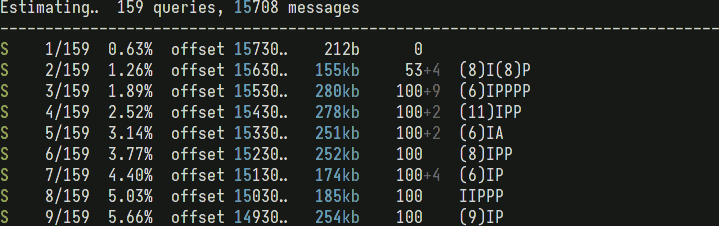

<h1 align="center">
   <!-- delameter/vkimexp -->
   <a href="##"></a>
   <a href="##"></a>
</h1>
<div align="right">
  <a href="##"></a>
  <a href="https://pepy.tech/project/vkimexp/"></a>
  <a href="https://pypi.org/project/vkimexp/"></a>
  <a href="https://github.com/psf/black"></a>
</div>
<br>

VK conversations exporter. 

## Motivation

Necessity to export VK conversations completely (with all attachments), not just the plain text (that's what official data export tool does).

## Features

- Suitable for regular dialogs as well as group conversations. 
- Supported attachment types: photos/images, voice messages, stickers.
- The history is exported in two formats: plain text and HTML with pagination. 
- All supported attachments are downloaded and referenced from HTML pages as local resources using relative paths, which allows to browse the exported history in offline mode (without Internet connection).
- Automatic authentication with `vk.com` using cookies loaded from a specified browser. Supported browsers (in a format accepted by `--browser` option): `chrome`, `firefox`, `safari`, `chromium`, `edge`, `opera`, `vivaldi`, `brave`.


## Installation

    pipx install vkimexp


## Usage

    vkimexp [OPTIONS] PEERS...

PEER should be VK ID of a person or a conversation in question (several PEERs can be provided at once). To find PEER of a person, open this page: https://vk.com/im and select the required dialog, and then his/her VK ID will appear in the address bar like this:

    https://vk.com/im?sel=1234567890                                               

where 1234567890 is a numeric ID in question. Use this number as PEER, e.g. for a person with VK ID 1234567890 the command is:

    vkimexp 1234567890                                                             

For group conversations there is no VK ID in the URL, as they are identified differently, by their index. Nevertheless, take this number (together with 'c'!) and provide it as is, the application will figure out VK ID of a conversation by itself:

    https://vk.com/im?sel=c195  =>  vkimexp c195                                   

### Options

    -b, --browser NAME  Browser to load cookies from (process is automatic). [default: chrome]
    -v, --verbose       Print more details.
    --help              Show this message and exit.


### Running



### Result 


## Troubleshooting

- #### Cannot authenticate the app

  Make sure you are logged into `vk.com` before launching the app. It's recommended to open or refresh `vk.com` page just before the start to ensure that cookies are fresh (if they expire, the export will fail to start). 

- #### Cannot authenticate the app (Gnome environment)

  Some system configurations require to set up an environment variable ```XDG_CURRENT_DESKTOP=GNOME``` for the app, so that the cookie extraction library could correctly identify the system keyring and, subsequently, to decrypt the cookies stored by browser. That can solve the cookie loading issue for Ubuntu 20, for example.

- #### Cannot authenticate the app with Google Chrome

  Try Firefox.

- #### Cannot authenticate the app with Firefox

  Try Google Chrome. 
 
  > Either of these almost certainly will work (and sometimes they both work  *\*gasp**).

- #### Cannot authenticate the app with any browser

  Run the application with `-v` option for more verbose output and see if the debugging information contains any unexpected exceptions or potenital clues. If all attempts to figure out what's going on are ineffective, feel free to [open an issue](issues).  Attaching the verbose output beforehand could simplify the task incredibly. 

## TODOs

- Option that disables cookie autoload and lets the user to specify all cookies manually.
- A way to customize output directory.
- `--color/--no-color` formatting control options.
- Parallel (multi-threaded) attachment downloads.
- Options to select which attachment types to process/ignore.
- GitHub Actions packaging automation.


## Changelog

### 1.2.0  <small><kbd>dec 23</kbd></small>

- Two extraction methods in a conjunction instead of one.
- Embedded CSS styles.

### 1.1.0  <small><kbd>dec 23</kbd></small>

- Full rewrite.

### 1.0.0  <small><kbd>oct 23</kbd></small>

- Prototype.
